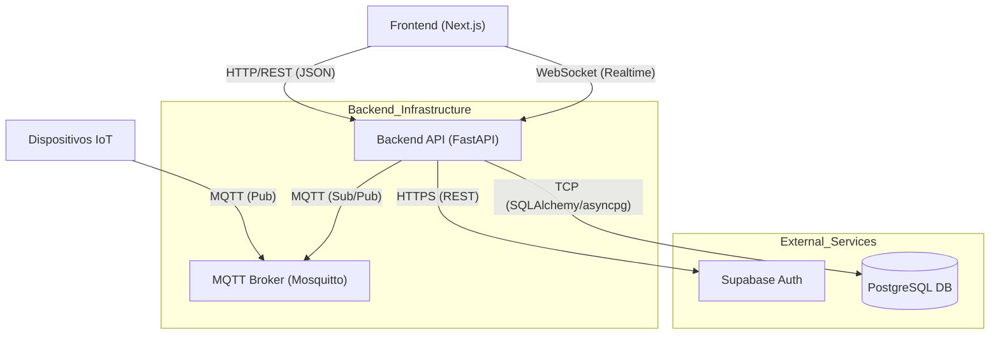

# Arquitectura del Backend - Alertrace

Este documento define la arquitectura técnica y estructura del backend de Alertrace.

## 1. Visión General
El backend está construido sobre **FastAPI** (Python 3.11), utilizando una arquitectura asíncrona para manejar operaciones de I/O intensivas (base de datos y MQTT). Actúa como orquestador entre el Frontend, los dispositivos IoT (vía MQTT) y la base de datos (Supabase/PostgreSQL).

### 1.1. Diagrama de Comunicación



## 2. Stack Tecnológico
-   **Framework Web**: FastAPI v1.1.0
-   **Lenguaje**: Python 3.11
-   **Base de Datos**: PostgreSQL (alojada en Supabase)
-   **ORM**: SQLAlchemy (con soporte AsyncIO y Sync)
-   **Driver DB**: `asyncpg` (asíncrono) y `psycopg2` (síncrono)
-   **Autenticación**: Supabase Auth (integrado vía API REST)
-   **IoT/Mensajería**: MQTT (Eclipse Mosquitto)
-   **Infraestructura**: Docker & Docker Compose

## 3. Estructura del Proyecto

```
backend/
├── api/                    # Capa de Aplicación
│   ├── routes/             # Endpoints (Controladores)
│   ├── models/             # Esquemas Pydantic (DTOs)
│   ├── services/           # Lógica de negocio y servicios externos (MQTT, WebSocket)
│   ├── monitoring/         # Configuración de Logs, Sentry y Prometheus
│   └── auth/               # Lógica de autenticación y dependencias
├── database/               # Capa de Datos
│   ├── models/             # Modelos ORM (SQLAlchemy)
│   ├── connection.py       # Configuración del Engine y Session (QueuePool)
│   └── scripts/            # Scripts de mantenimiento y seed
└── scripts/                # Scripts de utilidad (tests manuales, inspección)
```

## 4. Componentes Clave

### 4.1. Gestión de Base de Datos (`database/connection.py`)
-   **Motores**: Se mantienen dos motores, uno asíncrono (`AsyncEngine`) para las rutas de la API y uno síncrono para tareas de fondo o scripts.
-   **Pooling**: Se utiliza `QueuePool` para manejar eficientemente las conexiones a Supabase, evitando el agotamiento de conexiones y timeouts (problema resuelto con `pool_size=20`, `max_overflow=10`).
-   **Sesiones**: Inyección de dependencias `get_db` para manejo automático del ciclo de vida de la sesión por request.

### 4.2. Autenticación (`api/routes/auth.py`)
-   **Híbrida**: Utiliza Supabase Auth como proveedor de identidad (IdP) pero mantiene una tabla `trabajadores` local para relacionar usuarios con `empresas`.
-   **Flujo de Registro**:
    1.  Recibe `RegisterRequest` del Frontend.
    2.  Crea usuario en Supabase Auth.
    3.  Crea registro en tabla `empresas` (si aplica).
    4.  Crea registro en tabla `trabajadores` vinculado al `user_id` de Supabase.
-   **Flujo de Login**: Proxy hacia Supabase Auth para obtener JWT, luego verifica y enriquece la respuesta con datos del perfil local (`/me`).

### 4.3. IoT y Tiempo Real
-   **MQTT**: Servicio dedicado (`api/services/mqtt`) que se suscribe a tópicos de sensores.
-   **Procesamiento**: Los mensajes entrantes se validan con esquemas Pydantic y se persisten en la base de datos de forma asíncrona.

## 5. API Design
-   **Prefijo Global**: `/api/v1`
-   **Documentación**: Swagger UI disponible en `/docs`.
-   **CORS**: Configurado para permitir orígenes de desarrollo (`localhost:3000`, `localhost:5173`) y producción (Vercel).

## 6. Despliegue e Infraestructura
-   **Docker**: Contenedorización completa (`Dockerfile`).
-   **Docker Compose**: Orquestación local de API, Frontend y Mosquitto.
-   **Variables de Entorno**: Gestión centralizada vía `.env` (Credenciales DB, Supabase Keys, JWT Secrets).
